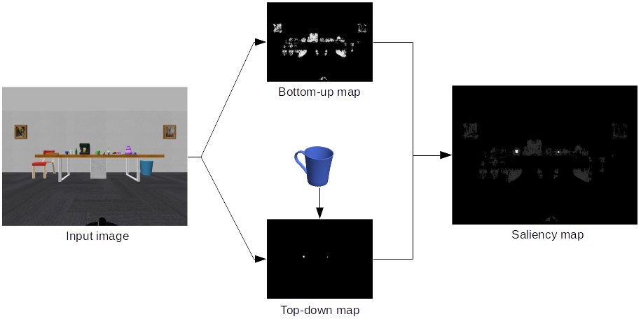

# Active visual search using saliency
This repository contains the active visual search code and the saliency map generator from the paper ["Visual Saliency Improves Autonomous Visual Search"](https://ieeexplore.ieee.org/abstract/document/6816832/). The code is written in C++ and comes as a stand-alone code or a [ROS](http://www.ros.org/) package.

The saliency code uses the color of the sought object and generates a bottom-up map using the [AIM](http://papers.nips.cc/paper/2830-saliency-based-on-information-maximization.pdf) algorithm and a top-down map using the [histogram backprojection](https://ieeexplore.ieee.org/document/139558/) technique. The final result is a weighted combination of both maps.

